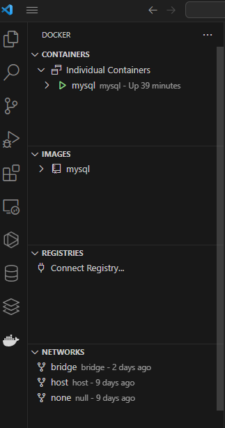
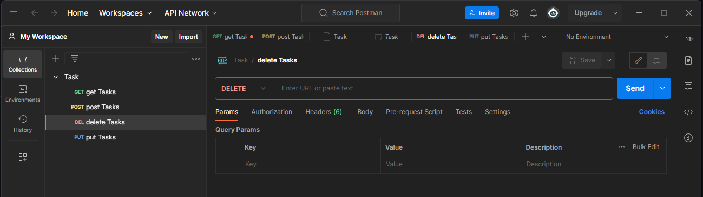

# Sistema de Gerenciamento de Tarefas Utilizando o NodeJs
1) Instalar todas dependências iniciais padrão do Node.

2) Configurar o package.json
3) Rodar o docker: docker run --name mysql -e MYSQL_ROOT_PASSWORD=SENHA -p PORT:PORT-d  mysql

## TECNOLOGIAS

Para o backend:
Node.js
Express
Docker 

Para o frontend:
HTML5 + CSS + JavaScript

Database:
Imagem do MySQL com o uso de Docker

# COMO USAR?

1) CREATE DATABASE IF NOT EXISTS NOME;
2) EXECUTRAR O COMANDO:

<code>
CREATE TABLE tasks(
    id INT PRIMARY KEY AUTO_INCREMENT,
    title VARCHAR(45) NOT NULL,
    status VARCHAR(45) NOT NULL,
    created_at VARCHAR(45) NOT NULL
);

</code>
ATRAVÉS DE UM ARQUIVO .ENV UTILIZAR:

PORT= [Porta]
MYSQL_HOST= [localhost ou outro]
MYSQL_USER= [Nome de usuário, por padrão é root]
MYSQL_PASSWORD= [Pode ser com ou sem senha]
MYSQL_DB= [Nome da base de dados]

Após instalar as dependências, você pode optar entre npm start ou npm run dev, a depender da configuração no package .JSON

Foi utilizado também o software POSTMAN para testes no backend com API REST.

## Base de dados de exemplo

## Docker

## POSTMAN
